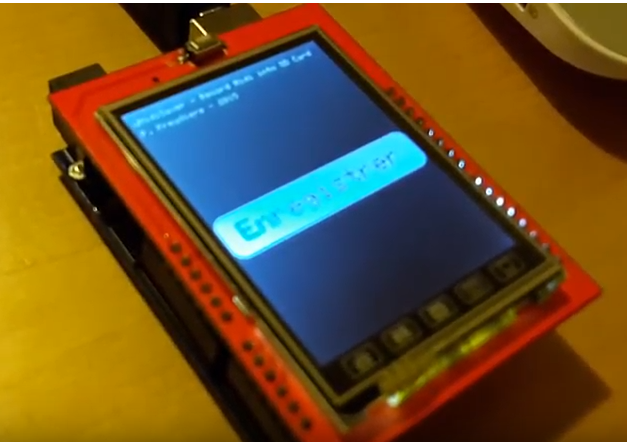
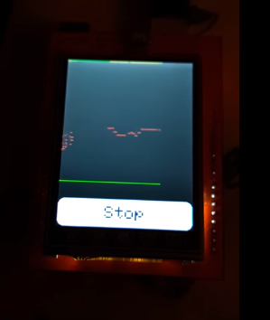

# ArduinoMidiSaver

*Patrice Freydiere 2016-2017*

Projet Arduino - Midi, permettant de sauvegarder et enregistrer des notes midi. 
un écran tactile permet de guider dans l'enregistrement.

Ce projet utilise :

- un arduino UNO
- une connection MIDI pluggée sur le port serie (TX/RX)
- un écran tactile sur une base de chipset SPFD5408 (Banggood)

## Fonctionnalités

OS Temps reel, pour ne pas impacter l'enregistrement pendant l'affichage (ChibiOS est utilisé)

Utilisation d'une SDCard intégré à l'écran pour la sauvegarde

## Utilisation

Le logiciel est très simple à utiliser depuis l'arduino, il n'y a qu'un bouton permettant de faire démarrer l'enregistrement. un autre bouton pour arreter l'enregistrement.

L'enregistrement est réalisé sur une carte micro SD, le fichier est au format texte.

Video de démonstration : [https://www.youtube.com/watch?v=o5rcnmFs6tQ](https://www.youtube.com/watch?v=o5rcnmFs6tQ)